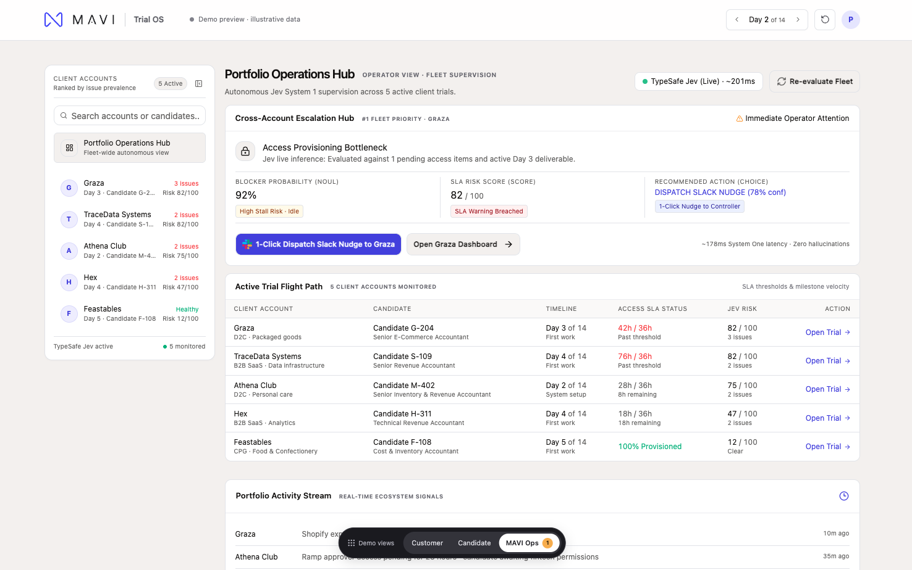
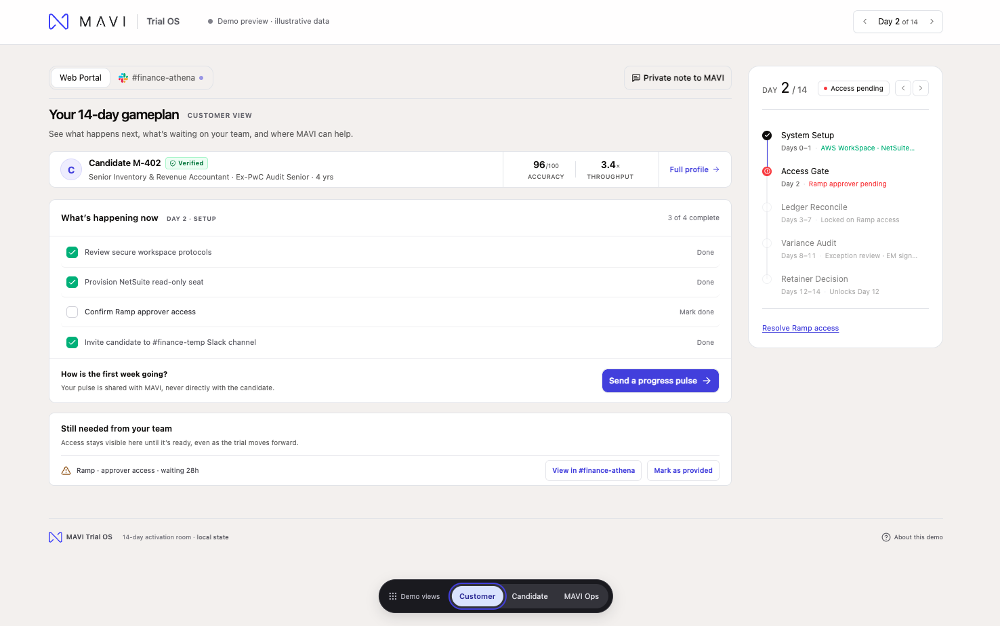
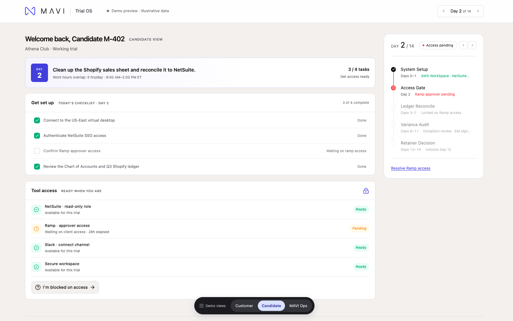

<div align="center">
  
  <h1>Trial OS</h1>
  <h3>Catch the access delay that kills a 14-day trial before the customer feels it.</h3>
  <p>A shared workspace for MAVI's risk-free trial, with an AI operator console that tells your team which account needs help right now and sends the nudge in one click.</p>
  <p>
    <a href="https://mavi-gtm-engine.vercel.app/"><b>Open the live demo</b></a> ·
    <a href="#a-2-minute-walkthrough">2-minute walkthrough</a> ·
    <a href="#powered-by-typesafe-jev">How the AI works</a>
  </p>
</div>

<p align="center">
  
</p>

---

## The problem

MAVI promises a **5-day placement** and a **14-day risk-free trial**. The trial is where the placement is won or lost, and the usual way it is lost is not candidate quality. It is friction:

- A customer's IT team hasn't granted NetSuite, Ramp, or Snowflake access, so a pre-vetted accountant sits idle on Day 2.
- Time to first value slips past the point where the CFO has already decided it isn't working.
- The operator finds out late, from a candidate message or a cold customer, instead of from a signal.
- With five or ten trials running at once, nobody can see which one is about to slip.

## What Trial OS does

One 14-day timeline, three coordinated views, and one control room.

| View | Who | What they get |
| :--- | :--- | :--- |
| **Customer** | Startup CFO / finance lead | A 14-day gameplan, what is still needed from their team, a private line to MAVI, and a `#finance-athena` Slack channel view where access can be granted in one tap. |
| **Candidate** | The MAVI accountant | Today's checklist, tool-access readiness, a secure virtual desktop launcher, and a way to report a blocker that the customer never sees. |
| **MAVI operator** | GTM / trial ops | A **cross-account escalation hub** that ranks every active trial by risk and recommends the next action, with 1-click Slack dispatch. |

Customer feedback and candidate blockers stay private from each other and visible only to MAVI. All three views read from the same trial state, so they tell one story.

<table>
  <tr>
    <td width="50%"></td>
    <td width="50%"></td>
  </tr>
  <tr>
    <td align="center"><sub><b>Customer</b>: what's waiting on their team</sub></td>
    <td align="center"><sub><b>Candidate</b>: today's checklist and a private way to flag a blocker</sub></td>
  </tr>
</table>

## The operator console

This is the part to look at first.

- **Fleet ranking.** Five client trials (Athena Club, Graza, TraceData, Hex, Feastables) are ranked by issue count and risk. The highest-priority account is pinned as the hero panel.
- **1-click Slack nudge.** The operator previews a structured message to the customer's trial channel and dispatches it. The blocker clears, the intervention is logged, and the next-highest-risk account moves to the top.
- **SLA tracking.** Pending access over **24 hours** raises operator attention. At **36 hours** it is a breach. A day scrubber advances every account's clock together so you can watch an account cross the threshold.
- **Company drill-down.** Open any account for its escalation, SLA dial, candidate dossier, milestone flight path (setup, first work, decision), and activity feed.
- **Live evidence.** A header badge shows whether recommendations came from the live model or the offline fallback, with latency.

## Powered by TypeSafe Jev

Triage is not a hand-written rule list. Each account snapshot is sent to [TypeSafe](https://typesafe.ai)'s **Jev System One** model through a server-side route, [`/api/triage`](src/app/api/triage/route.ts). Jev returns typed judgments rather than free text, so the UI can rely on them:

| Output | Type | Meaning |
| :--- | :--- | :--- |
| `is_critical_blocker` | probability (0 to 1) | How likely this account is blocked on something critical. |
| `sla_risk_score` | probability-weighted score | How close the trial is to breaching its access SLA, with confidence. |
| `recommended_action` | one of three choices | `DISPATCH_SLACK_NUDGE`, `REPLAN_OFFLINE_TASK`, or `MONITOR_SCHEDULE`. |

The API key stays on the server and is never sent to the browser. If the key is missing or a request fails, that account falls back to a calibrated local evaluator, so the demo never breaks. The header badge tells you which path produced the numbers.

## Try it

**Live:** [mavi-gtm-engine.vercel.app](https://mavi-gtm-engine.vercel.app/). No login, nothing to install. It opens on the **MAVI operator** view.

**Run it locally**

```bash
git clone https://github.com/pooosh/mavi-gtm-engine.git
cd mavi-gtm-engine
npm install
cp .env.example .env.local   # add TYPESAFE_API_KEY for live Jev (optional)
npm run dev
```

Then open **http://localhost:3000/portal**.

### A 2-minute walkthrough

1. **Operator hub.** Note the #1 priority account and the Jev recommendation.
2. Click **1-Click Dispatch Slack Nudge**, review the message, and send it. Watch the next account take the top spot.
3. Press `]` to advance the trial day. Pending access hours climb on every account until one breaches the 36-hour SLA.
4. Open an account from the table for the company drill-down.
5. Use the floating **Demo views** switcher to jump to the **Customer** view, open `#finance-athena`, and grant access. Switch back to see the operator's flight path update.
6. Switch to **Candidate** to see the discreet blocker report.

Keyboard: `[` and `]` (or `Alt` + arrow keys) move the demo day.

## What is real and what is illustrative

This is a **pitch prototype**, and it is explicit about that.

- **Real:** the Jev System One call. With a key, risk scores and recommended actions come from the live model.
- **Illustrative:** client names, candidates, AI scorecards, timelines, and security details are seeded demo data, labeled as such in the UI.
- **Simulated:** Slack nudges, virtual desktop launch, and access grants. No message is sent and no system is provisioned.
- **Out of scope:** authentication, email, billing, contracts, and any compliance attestation. The role switcher previews perspectives; it is not access control.

## Under the hood

| | |
| :--- | :--- |
| Framework | Next.js 15 (App Router), React 19 |
| Language | TypeScript, strict mode |
| Styling | Tailwind CSS 4, Radix UI primitives, Lucide icons |
| State | Client-side reducer (`src/lib/trial.ts`), no database |
| AI | TypeSafe Jev System One via a server route |
| Hosting | Deploys to Vercel as-is. No separate backend. |

```
src/
├── app/
│   ├── api/triage/route.ts          # Jev System One call + calibrated fallback
│   └── portal/
│       ├── trial-portal.tsx         # Shell, top bar, role switcher, customer/candidate flows
│       └── operator-dashboard.tsx   # Fleet hub, flight path, company drill-down
├── components/                      # Slack simulator, Slack channel view, timeline, UI primitives
├── lib/trial.ts                     # Trial templates, health rules, SLA thresholds, reducer
└── types/                           # Jev and portal types
```

Design and product intent live in [`PRODUCT.md`](PRODUCT.md) and [`DESIGN.md`](DESIGN.md).

## Deploy

Push to GitHub and import the repo into [Vercel](https://vercel.com). Add `TYPESAFE_API_KEY` under **Environment Variables**. The `/api/triage` route runs as a serverless function.

```bash
npm run typecheck   # TypeScript check
npm run build       # Production build
```

## Contact

Piyush Shanbhag, [piyushshanbhag8@gmail.com](mailto:piyushshanbhag8@gmail.com)

<div align="center">
  <sub>Built for MAVI. Trial data is illustrative.</sub>
</div>